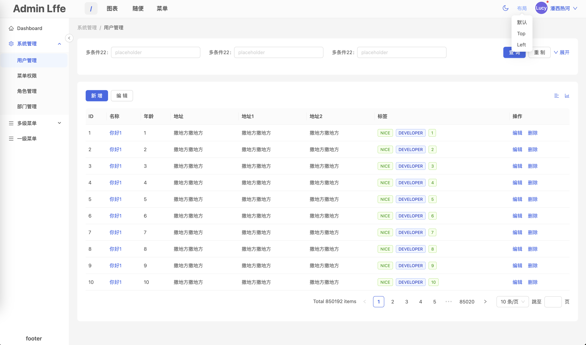
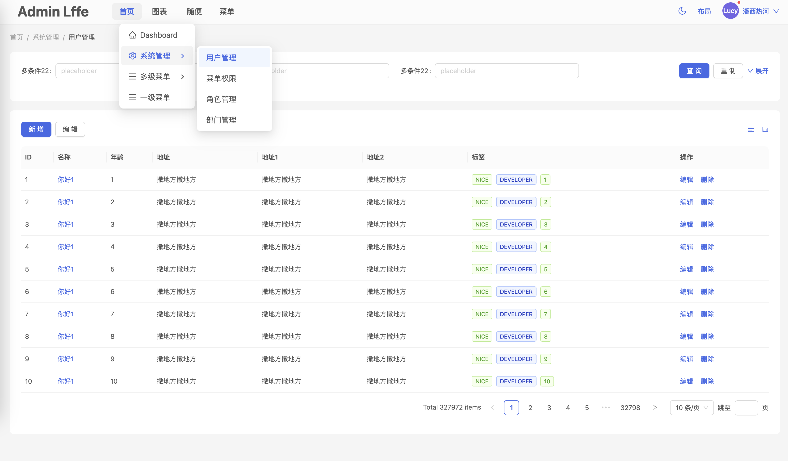
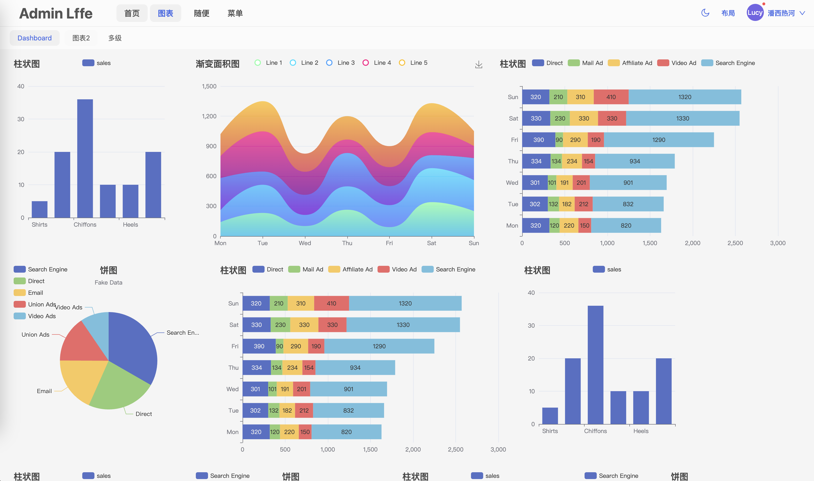
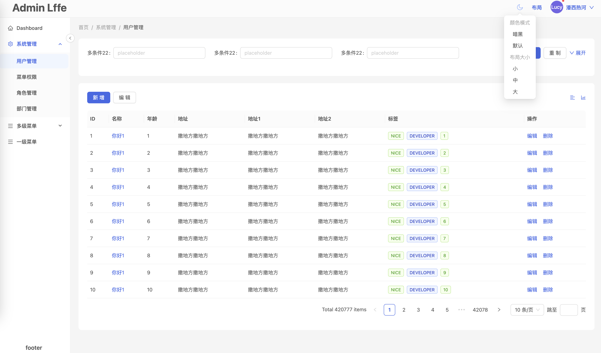
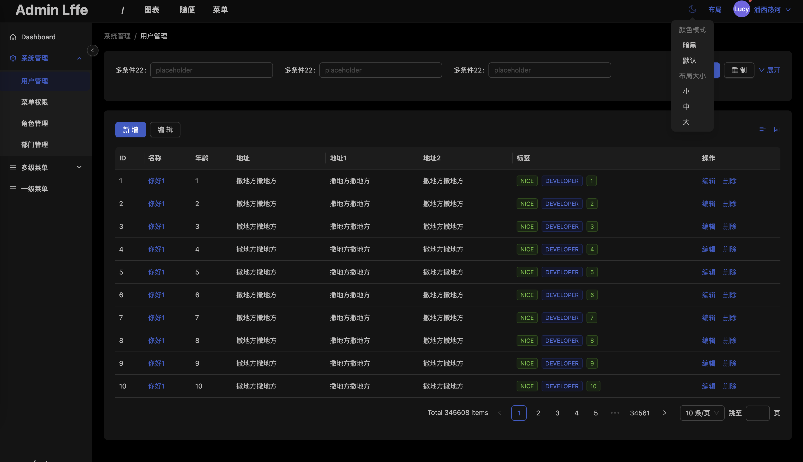

# vite5 + React18 + antd-design5 简约风后台管理模版

## 🎉 特性
- 💪 所有数据通过mock模拟请求
- 🌍 多形态菜单布局，动态切换
- 💅 动态路由、菜单、登录token等
- 👏 暗黑主题切换，布局大小调整，持久化
- 👏 过度动画，提高用户体验
- 🥳 尽量简洁不臃肿，减少使用第三方lib

## 🎉 持续完善中









## 安装使用

```bash
git https://github.com/rehe0x/rehe-admin-antd-template.git
```


```bash
cd rehe-admin-antd-template

yarn install

```

- 运行

```bash
yarn run dev
```

- 打包

```bash
yarn run build:dev
```


